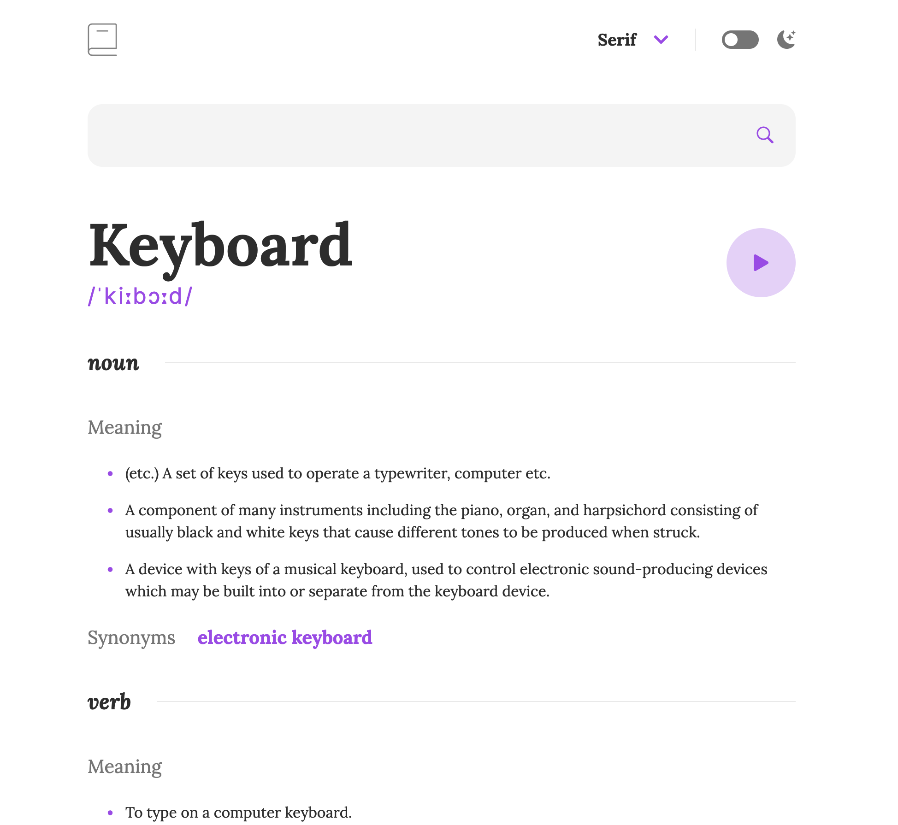

# Dictionary Web App

Live website: [Live App](https://dictionary-app-roan.vercel.app/)

This is a repository for the [Dictionary Web App](https://amirintech.github.io/dictionary-app/), a project solution for the [Frontend Mentor Challenge](https://www.frontendmentor.io/challenges/dictionary-web-app-h5wwnyuKFL).

## Project Overview

The Dictionary Web App is a real-world application that integrates with the Dictionary API to provide a dictionary service. Users can search for words, see the dictionary API's response for the searched words, play the audio file for a word when it's available, switch between serif, sans serif, and monospace fonts, switch between light and dark themes, and view the optimal layout for the interface depending on their device's screen size. The application is built with React & tailwindCSS.

## Features

- Word search using the input field
- Display of the Free Dictionary API's response for the searched word
- Form validation message when trying to submit a blank form
- Audio file play for a word when it's available
- Font switching between serif, sans serif, and monospace fonts
- Theme switching between light and dark themes
- Responsive design for optimal layout on different device screen sizes
- Hover and focus states for all interactive elements on the page
- Automatic color scheme selection based on user's preferences
